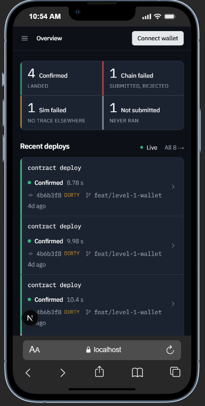
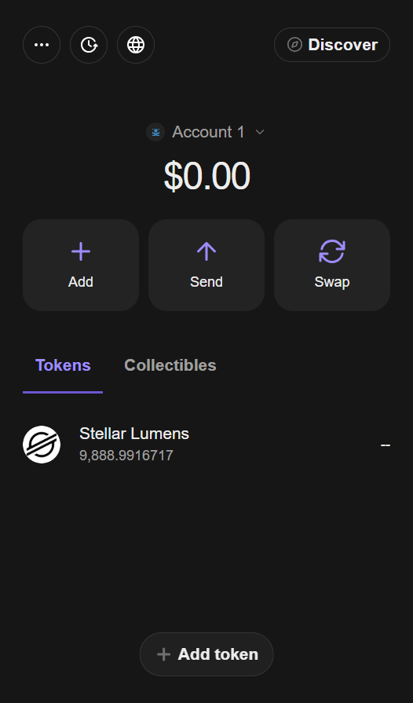
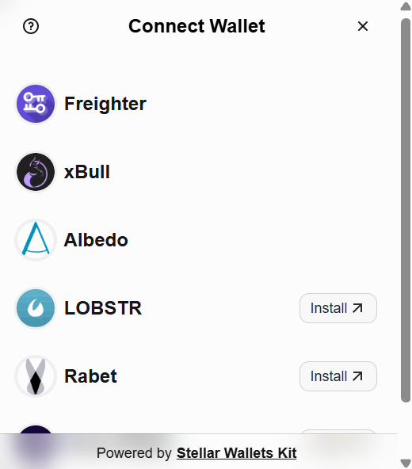
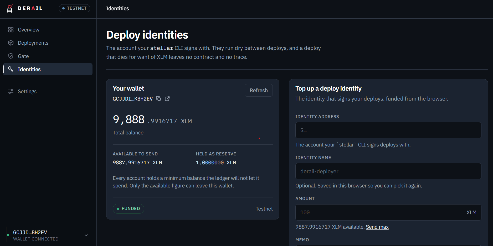
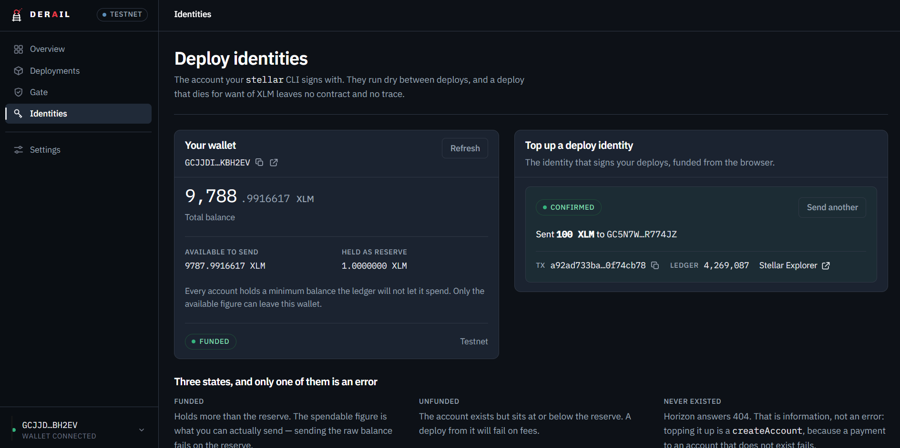
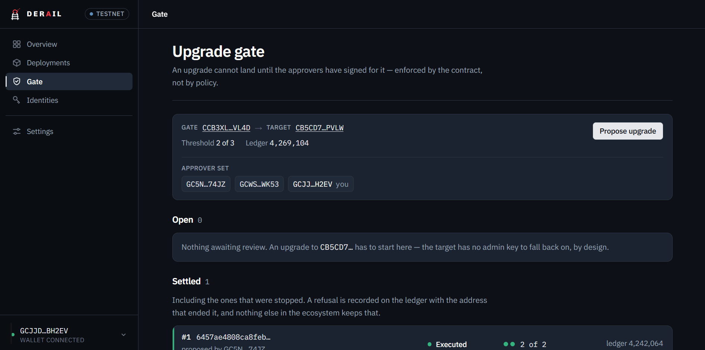
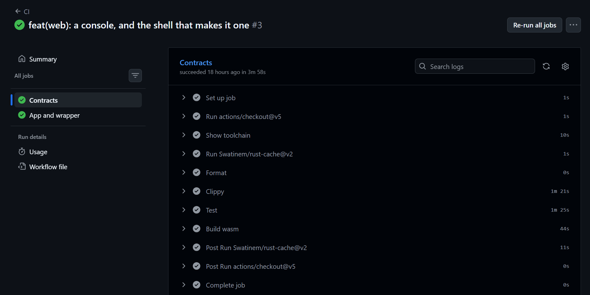
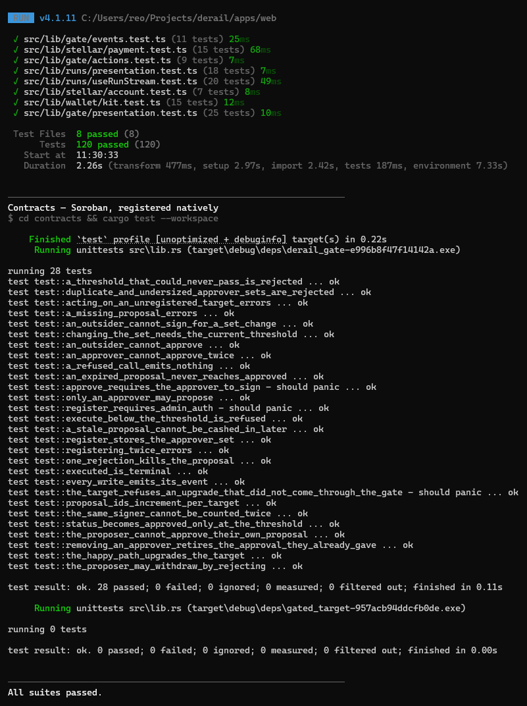

<p align="center">
  
</p>

<h1 align="center">Derail</h1>

<p align="center">
  <strong>Deploy observability for Soroban — and a gate for the deploys that shouldn't land.</strong>
</p>

<p align="center">
  Put <code>derail</code> in front of a <code>stellar</code> command and every deploy attempt is
  recorded — including the ones that never produced a contract. Then
  <a href="./contracts/derail_gate"><code>derail_gate</code></a> holds a contract's upgrade
  authority, so an upgrade cannot land until N approvers have signed for it on
  <a href="https://stellar.org">Stellar</a>.
</p>

<p align="center">
  <a href="https://derail-tau.vercel.app"></a>
  <a href="https://derail-tau.vercel.app/gate"></a>
  <a href="#demo-video"></a>
  <a href="https://stellar.expert/explorer/testnet/contract/CCB3XL2VY6WGWGSVVRNBWGZZQ3SSXVRCMUTJ3XVFU7R5N2MS7UYOVL4D"></a>
</p>

<p align="center">
  <a href="https://derail-tau.vercel.app">Live demo</a> ·
  <a href="https://derail-tau.vercel.app/gate">Review screen</a> ·
  <a href="#demo-video">Demo video</a> ·
  <a href="#proven-on-chain">Proven on-chain</a> ·
  <a href="#stellar-wallet-integration-testnet">Wallet integration</a> ·
  <a href="#contract-interface">Contract interface</a>
</p>

<p align="center">
  
  
  
  
  
  
  
</p>

---

## Problem

Every tool in the Stellar ecosystem tracks artifacts that **succeeded**. Explorers,
attestations and registries all start from a contract that exists.

That leaves two blind spots that matter most exactly when things go wrong:

- **A deploy that died at simulation produces nothing.** No contract, no attestation, no
  explorer entry — four of seven runs in our own [spike](./spike/FINDINGS.md) left no
  recoverable trace anywhere. The command ran, money and time were spent, and the record
  is a line in someone's terminal scrollback.
- **An upgrade that was *refused* produces nothing either.** A reviewer says no; the
  evidence is a message in a thread. The one deploy you most need on the record — the
  dangerous one somebody stopped — is the one nothing keeps.

In short: **contract deploys are rare, high-stakes and irreversible, and nobody has an
independently verifiable record of the attempts.**

## Solution

**Derail** is a deploy wrapper with an on-chain approval gate.

| Layer | What it does |
|---|---|
| **`derail` wrapper** | Put it in front of any `stellar` command. It records the command, arguments, git state, simulation result and on-chain outcome — whether or not a contract came out the other end |
| **Poller** | Resolves each recorded transaction against the chain a minute later, unattended, so a run that was pending becomes success or failure without anyone watching |
| **Run timeline** | Renders command → simulation → submission → outcome on one screen, including the stages that never happened, and stays live over Supabase Realtime |
| **`derail_gate` (Soroban)** | Holds a target contract's upgrade authority. An upgrade cannot execute until the threshold of approvers has signed for it — enforced by the contract, not by policy |
| **`gated_target` template** | The reference contract teams build on: `upgrade()` wired to the gate instead of an admin key |

**Result:** every deploy attempt is on the record, and every upgrade decision — approved
*or* rejected — is an individual on-chain transaction anyone can verify.

## Vision

A rule in a database is bypassed by running the CLI directly. A rule in a contract is not.

1. Wrap the real work — every `stellar` deploy runs through `derail` and lands on the timeline.
2. Put the dangerous change behind the gate: propose the new wasm hash, and it cannot ship
   until N approvers each sign an on-chain approval.
3. If it should not ship, **reject it** — and that rejection is a permanent ledger artifact
   with the address that ended it recorded against it.
4. Verify any of it against the public ledger, without access to the workspace that produced it.

> "Approved vs actually shipped" — and "proposed vs refused" — stop being claims in a thread
> and become receipts on chain.

---

## Demo and evidence

| Asset | Link |
|---|---|
| **Live app** — running on Stellar Testnet | [derail-tau.vercel.app](https://derail-tau.vercel.app) |
| **Review screen** — propose / approve / reject / execute from the browser | [derail-tau.vercel.app/gate](https://derail-tau.vercel.app/gate) |
| **Demo video** — 1–2 min walkthrough | <a id="demo-video"></a> _link to be added_ |
| **CLI workflow** — one run of every outcome class | [`packages/cli/README.md`](./packages/cli/README.md) |
| **The upgrade that went through the gate** — `execute` → `target.upgrade`, cross-contract | [View on Stellar Expert](https://stellar.expert/explorer/testnet/tx/495dc34c2e80f47801864e7c49a98bb24ad71323464d3ca64572901b13dcfb6b) |
| **The upgrade that was stopped** — permanently `Rejected` on the ledger | [View on Stellar Expert](https://stellar.expert/explorer/testnet/tx/0b799b2f86446a129d001a381243893644ef23a7e0c5cfb1a329733d853baeb8) |
| **Deployed gate** — `derail_gate`, 8 functions | [View on Stellar Expert](https://stellar.expert/explorer/testnet/contract/CCB3XL2VY6WGWGSVVRNBWGZZQ3SSXVRCMUTJ3XVFU7R5N2MS7UYOVL4D) |

---

## Features

### The wrapper (`packages/cli/`)

- **Records the attempt, not just the artifact** — command, arguments, git commit and dirty
  state, simulation outcome, and the on-chain result, on one row
- **Captures the runs nothing else keeps** — a deploy that fails at simulation, or one that
  simulates clean and then fails on-chain, is a first-class record rather than a gap
- **Ingest is authenticated per project** by a token whose hash never reaches the browser

### The gate (`contracts/`)

- **Upgrade authority lives in the contract** — `derail_gate` holds it; the target trusts
  only the gate, and has no admin key of its own to fall back to
- **A real proposal state machine** — `Open → Approved → Executed`, plus `Rejected` and
  `Expired`, with `Approved`/`Expired` derived on read so storage can never claim a state
  the live rules disagree with
- **Approvals are individual transactions** — each approver signs their own, so a rejected
  or abandoned proposal still leaves a trace (see [§ Approvals](#approvals-are-individual-transactions))
- **Guards that matter** — proposer can't approve their own change, approvers can't approve
  twice, removed approvers stop counting immediately, and proposals expire (~7 days)
- **Events** — `registered · proposed · approved · rejected · executed · approvers`, each
  with `derail` as topic 0 and the target address indexed, declared `#[contractevent]`

### The app and wallet (`apps/web/`)

- **Multi-wallet connect** through StellarWalletsKit — Freighter, xBull, Albedo, Lobstr,
  Rabet, Hana — with the session surviving a refresh
- **XLM balance**, separating a funded account from one that has never existed (Horizon
  answers 404 for the second — information, not an error)
- **Top up a deploy identity** — send XLM to the account your `stellar` CLI signs with; an
  identity that has never been funded is *created* by the same transaction
- **Distinct failure states** for wallet-not-found, user-rejected and insufficient-balance,
  each carrying the transaction hash and an Explorer link
- **The review screen** reads the live contract, lists every proposal, and offers
  propose / approve / reject / execute as wallet-signed transactions

**Responsive to phone width.** The run list, the run detail timeline and the review screen
stack to one column below the desktop breakpoint:



### Data layer (`supabase/`)

- Plain-SQL migrations with **RLS enabled and no write policies** — the browser reads its
  own project's runs and writes nothing; ingest and the poller go through the service role
- The **run timeline is kept live over Supabase Realtime**, and the poller resolves pending
  transactions as an Edge Function

---

## Proven on-chain

Everything below is on the public testnet ledger, not a screenshot. Each link opens on
Stellar Expert.

### The upgrade that went through the gate

The target answered `version() = 1`. Two different approvers each signed, in separate
transactions. The gate then called `target.upgrade()` **across contracts**, and it now
answers `2`. No admin key exists anywhere in that path — the target does not have one.

| Step | Transaction |
|---|---|
| Propose | [`ac8b2e5f…`](https://stellar.expert/explorer/testnet/tx/ac8b2e5f400c87d32fd4d5d2c83dbeb7b0127197b76b5b2ec63e9f9527c9cc8e) |
| Approve — a *different* approver, signed separately | [`b56b8b77…`](https://stellar.expert/explorer/testnet/tx/b56b8b7712ac39865e49446ca9c850bcc7a4d1b5f12aae75a7d3dd99c975a114) |
| **Execute — `derail_gate::execute` → `target::upgrade`** | [`495dc34c…`](https://stellar.expert/explorer/testnet/tx/495dc34c2e80f47801864e7c49a98bb24ad71323464d3ca64572901b13dcfb6b) |

The new code is [`gated_target/src/lib.rs`](./contracts/gated_target/src/lib.rs) at wasm hash
`6457ae48…f584cf`. The commit that changed that line is the change the approvers signed for —
the entire thesis of the product in one diff.

### The upgrade that was stopped

**This is the product.** Proposal 2 carried the old v1 hash, one approver refused it, and it
is now permanently `Rejected` on the ledger with the address that ended it recorded against it.

| Step | Transaction |
|---|---|
| Propose | [`23abf612…`](https://stellar.expert/explorer/testnet/tx/23abf61217b0892a87c3b2858c7bf10059aed880d4c6c13aab723bcaca419c9d) |
| **Reject — terminal** | [`0b799b2f…`](https://stellar.expert/explorer/testnet/tx/0b799b2f86446a129d001a381243893644ef23a7e0c5cfb1a329733d853baeb8) |

Nothing else in the ecosystem keeps that record, because approvals here are individual
transactions rather than signatures collected off-chain.

### Deploys the wrapper recorded

| | |
|---|---|
| Deploy identity | [`GC5N7WGW…774JZ`](https://stellar.expert/explorer/testnet/account/GC5N7WGWHHZEJ2PEIYAREWKGNQSWR3CME2HXBXKOJ65F3MPL27R774JZ) |
| A recorded deploy | [`3c23eee4…`](https://stellar.expert/explorer/testnet/tx/3c23eee4821aaa46550511bc3a07f9c65a3b7b2fbbc0436f04ed96caac093ad8) — ledger 4,187,234 |
| **A deploy that passed simulation and failed on-chain** | [`0f047f12…`](https://stellar.expert/explorer/testnet/tx/0f047f1282f32969564e6b9d1d4df6558b93ff1fc73a3519a85457f552c27520) — ledger 4,180,380 |

The explorer will tell you that last transaction failed. It will not tell you that
simulation predicted success, which commit it came from, or that the working tree was dirty
at the time. Derail records all three.

---

## Deployed contracts

The app runs against **Stellar Testnet**. Mainnet is deliberately out of scope until a later
level — the target carries no admin key and no standalone `upgrade` entry point reachable by
anyone but the gate.

### Stellar Testnet

| Contract | Address |
|---|---|
| **`derail_gate`** | [`CCB3XL2V…VL4D`](https://stellar.expert/explorer/testnet/contract/CCB3XL2VY6WGWGSVVRNBWGZZQ3SSXVRCMUTJ3XVFU7R5N2MS7UYOVL4D) |
| Gated target — **2 of 3** approval | [`CB5CD7U6…PVLW`](https://stellar.expert/explorer/testnet/contract/CB5CD7U6HTHZNEYGR7XYOJOOR2NJ2DMNP5ULYIWN5LSLLOK32YLVPVLW) |
| Gated target — **1 of 2** approval | [`CANKH6MW…YLUD`](https://stellar.expert/explorer/testnet/contract/CANKH6MWENNYKHPG7GPRXXNWR5J5RKENK2I2YVZHCXTPW33KBNCFYLUD) |

One gate governs both targets. The 2-of-3 set includes a browser wallet, because approving
from a browser is the point; the 1-of-2 set is driven from the CLI.

| Field | Value |
|---|---|
| Network | Stellar Testnet (`Test SDF Network ; September 2015`) |
| Gate functions | 8 exported (`register_target`, `propose_upgrade`, `approve`, `reject`, `execute`, `set_approvers`, `get_proposal`, `get_target`) |
| Upgraded target wasm hash | `6457ae48…f584cf` — the code the approvers signed for |

---

## Stellar wallet integration (testnet)

End-to-end wallet flow on **Stellar Testnet**, signed in the browser and verified on-chain.
Source images live in [`materials/screenshots/`](materials/screenshots).

| Field | Value |
|---|---|
| Network | Stellar Testnet (`Test SDF Network ; September 2015`) |
| Demo wallet | [`GCJJDIZZ…H2EV`](https://stellar.expert/explorer/testnet/account/GCJJDIZZ4PRVXDXEU6KXCNIGFGCZF5CJAXOQSC7QFQ3ACNX7VRKBH2EV) |
| Gate contract | [`CCB3XL2V…VL4D`](https://stellar.expert/explorer/testnet/contract/CCB3XL2VY6WGWGSVVRNBWGZZQ3SSXVRCMUTJ3XVFU7R5N2MS7UYOVL4D) |

### 1. Wallet setup

Freighter installed, switched to **Stellar Testnet**, and funded from Friendbot. An unfunded
account returns 404 from Horizon; the balance panel treats that as `funded: false` and offers
a Friendbot top-up rather than erroring.



### 2. Wallet connection

Connecting opens the StellarWalletsKit chooser rather than hard-wiring one extension — six
wallets are offered, and the ones not installed link out to install rather than failing
silently.

**Wallet options available:**



**Connected**, with the address read back from the extension, the network, and a disconnect
control:



| Behaviour | Where |
|---|---|
| **Connect** — opens the kit chooser, returns the public key | `apps/web/src/lib/wallet/` |
| **Disconnect** — drops the kit's stored address | `apps/web/src/lib/wallet/` |
| Session survives a page refresh | wallet provider restores from the kit |
| Live connection state | kit state subscription |

The kit is imported inside each call rather than at module scope, because it touches
`localStorage` during evaluation — which breaks server rendering of client components. Keys
never reach the app: transactions are built server-side and signed inside the wallet.

### 3. Balance handling

The connected account's XLM balance is read from testnet Horizon and shown in the UI. A 404
comes back as **"not funded yet"**, not an error, because on Testnet that is one Friendbot
click away from being funded.

Amounts are handled as integer stroops end to end — seven decimal places do not survive a
round trip through a float, and a rounding error in a balance is a wrong balance.

### 4. Transaction flow

**Top up a deploy identity** is the Level 1 send: XLM from the browser wallet to the account
your `stellar` CLI signs deploys with. Success and failure are both shown, each with the
transaction hash linked to Stellar Expert.



Success is asserted, not assumed: a transaction can be included in a ledger and still have
failed, so the outcome is reported from the result rather than from "it was submitted". A
rejected signature is reported as a rejection, not a crash, and simulation runs *before* the
wallet is asked to sign — so a contract error surfaces as a message instead of a paid-for
failed transaction.

If you would rather verify a browser-signed transaction on the ledger right now, the
`approve` above — [`b56b8b77…`](https://stellar.expert/explorer/testnet/tx/b56b8b7712ac39865e49446ca9c850bcc7a4d1b5f12aae75a7d3dd99c975a114) —
is one: a contract invocation, signed in the browser, permanently on chain.

**Calling the contract from the browser** is the review screen at
[`/gate`](https://derail-tau.vercel.app/gate) — propose, approve, reject and execute are all
wallet-signed:



---

## Tech stack

| Layer | Package | Version |
|---|---|---|
| Smart contracts | [soroban-sdk](https://crates.io/crates/soroban-sdk) | `27.0.4` |
| Contract language | [Rust](https://www.rust-lang.org/) — `wasm32v1-none` | `rustc 1.97.1` |
| CLI / deploy | [Stellar CLI](https://developers.stellar.org/docs/tools/cli) | `27.1.0` |
| Frontend | [Next.js](https://nextjs.org/) + [React](https://react.dev/) | `16.3.1` / `19.2` |
| Language | [TypeScript](https://www.typescriptlang.org/) | `5` |
| Database + realtime | [Supabase](https://supabase.com/) — Postgres, RLS, Realtime, Edge Functions | — |
| Chain client | [@stellar/stellar-sdk](https://www.npmjs.com/package/@stellar/stellar-sdk) | `16.2.0` |
| Wallet | [@creit.tech/stellar-wallets-kit](https://www.npmjs.com/package/@creit.tech/stellar-wallets-kit) + Freighter | `2.5.0` |
| Styling | [Tailwind CSS](https://tailwindcss.com/) | `v4` |
| Tests | [Vitest](https://vitest.dev/) + `cargo test` | `4` |

---

## Repository layout

```text
derail/                       # git repo root (npm + Cargo workspaces)
├── apps/web/                 # Next.js app — run list, timeline, review screen, ingest API, wallet
├── packages/cli/             # the `derail` wrapper
├── packages/gate-client/     # generated TypeScript bindings for the deployed gate
├── contracts/                # derail_gate and the gated_target starter template (Rust)
├── supabase/                 # SQL migrations and the poller Edge Function
├── scripts/                  # project seeding and gate deployment
├── spike/                    # CLI output measurements the wrapper design rests on
├── materials/screenshots/    # submission evidence
└── .github/workflows/        # CI
```

---

## Architecture

```text
   Browser                  apps/web (Next.js server)        Stores / chain
 ┌────────────┐            ┌────────────────────┐      ┌──────────────────┐
 │  Wallet    │  sign XDR  │  review screen      │ RLS  │ Supabase Postgres│
 │ (Freighter │◄──────────►│  wallet + balance   ├─────►│  runs · realtime │
 │  + 5 more) │            │  ingest API         │      │  (no write policy)│
 └─────┬──────┘            └─────────┬──────────┘      └──────────────────┘
       │                             │ build · simulate · submit
       │                             ▼
 ┌─────┴──────┐            ┌────────────────────┐      ┌──────────────────┐
 │  derail    │  ingest    │  Soroban RPC        ├─────►│ derail_gate ─────┼──► gated_target
 │  CLI wrap  ├───────────►│  Horizon · poller   │      │ (Stellar Testnet)│    upgrade()
 └────────────┘            └────────────────────┘      └──────────────────┘
```

The gate holds the target's upgrade authority, so `execute` is a **cross-contract call**:
`derail_gate::execute` invokes `target::upgrade`, and the target's `upgrade()` does
`gate.require_auth()` — only the gate can call it. A database cannot sign a Soroban
transaction, which is exactly why the approval logic has to live in a contract at all.

The wrapper signs deploys from the terminal and ingests each attempt; the browser signs
approvals. Both paths land on the same timeline, kept live over Supabase Realtime.

---

## Contract interface

### `derail_gate`

| Function | Auth | Description |
|---|---|---|
| `register_target(target, approvers, threshold, admin)` | admin | Register a target and its approver set; errors `TargetAlreadyRegistered` (1) rather than overwriting |
| `propose_upgrade(target, new_wasm_hash, proposer)` | proposer ∈ approvers | Open a proposal to swap the target's code; returns the proposal id |
| `approve(target, proposal_id, approver)` | approver ∈ approvers | One signature, one transaction; proposer can't self-approve, no double approvals |
| `reject(target, proposal_id, approver)` | approver ∈ approvers | Terminal — one rejection kills it, and records `rejected_by` |
| `execute(target, proposal_id)` | **none** | Cross-contract `target.upgrade()`; every condition was already signed for, so anyone may push the button once the threshold is met |
| `set_approvers(target, approvers, threshold, signers)` | current threshold | Replace the approver set — authorised by the approvers, never by the admin |
| `get_proposal(target, proposal_id)` | none | Read a proposal, with `Approved`/`Expired` resolved against current state |
| `get_target(target)` | none | Read a target's approver set and threshold |

**Statuses:** `Open · Approved · Executed · Rejected · Expired` — only `Open`, `Executed` and
`Rejected` are ever stored; `Approved` and `Expired` are derived on read.

**Errors:** `TargetAlreadyRegistered = 1` · `TargetNotRegistered = 2` · `ProposalNotFound = 3` ·
`NotAnApprover = 4` · `AlreadyApproved = 5` · `SelfApproval = 6` · `ProposalClosed = 7` ·
`ProposalExpired = 8` · `ThresholdNotMet = 9` · `InvalidThreshold = 10` · `InvalidApprovers = 11`

**Threshold is bounded below the set size.** The proposer can't approve their own change, so a
2-approver / threshold-2 target could never pass anything — the ceiling is one below the set
size, and the error surfaces at registration rather than at the first stuck upgrade.

### `gated_target` (template)

| Function | Auth | Description |
|---|---|---|
| `initialize(gate)` | — | Bind this contract to a gate, once and irreversibly. There is **no `set_gate`** |
| `upgrade(new_wasm_hash)` | gate | Swap this contract's code; authority read from storage, never taken as an argument |
| `gate()` | none | Read the bound gate address |
| `version()` / `set_message()` / `message()` | — | Example payload, safe to replace |

---

## Approvals are individual transactions

Soroban can collect pre-signed authorization entries off-chain and submit one transaction at
the end. **Derail deliberately does not.** A rejected proposal, or one abandoned at 1-of-2,
would then leave no on-chain trace at all — recreating the exact problem this product exists
to solve, in the one place it would be least forgivable.

Each approver pays their own fee. That is real onboarding friction, and it is why fee
sponsorship is the planned advanced feature.

## Governance cannot be retrofitted

[`gated_target`](./contracts/gated_target) has no `set_gate`. A contract that can be
re-pointed at a different gate by whoever holds a key is gated *until someone decides
otherwise*, which is not gated. **A contract already live with a plain admin key answers to
that key forever.** This costs nothing to adopt at first deploy and is impossible to adopt
later — the sharpest constraint in the product, which is why it is stated here and not in a
footnote.

---

## Quick start — app (`apps/web/`)

The app is deployed at **[derail-tau.vercel.app](https://derail-tau.vercel.app)** — connect a
Freighter wallet on Testnet and it works without any of the setup below. To run it locally:

Prerequisites: Node.js 20.9+, a Supabase project, and [Freighter](https://www.freighter.app/)
set to **Stellar Testnet**.

```bash
npm install     # also builds the generated contract bindings (gate-client)
npm run dev     # http://localhost:3000
```

Copy [`apps/web/.env.example`](./apps/web/.env.example) to `apps/web/.env.local` and fill it
in. The Supabase values come from your project settings; the contract ids for the live testnet
pair are already in the example file.

| Variable | Needed for |
|---|---|
| `NEXT_PUBLIC_STELLAR_NETWORK` | `testnet` (default) or `public` |
| `NEXT_PUBLIC_SUPABASE_URL`, `NEXT_PUBLIC_SUPABASE_PUBLISHABLE_KEY` | run timeline, Realtime |
| `SUPABASE_SERVICE_ROLE_KEY` | ingest and poller — **server only**, bypasses RLS |
| `DERAIL_PROJECT_ID` | the single project this scope is pinned to |
| `NEXT_PUBLIC_DERAIL_GATE_ID`, `NEXT_PUBLIC_DERAIL_TARGET_ID` | the review screen |

### Checks

```bash
npm test            # 100 frontend tests (Vitest)
npm run typecheck
npm run lint
cd contracts && cargo test --workspace   # 28 contract tests
```

Both halves run in CI on every push — [`.github/workflows/ci.yml`](./.github/workflows/ci.yml).

---

## Quick start — contract (`contracts/`)

Prerequisites:

- Rust stable + `rustup target add wasm32v1-none`
- [Stellar CLI](https://developers.stellar.org/docs/tools/cli) `27.1.0`

```bash
cd contracts
cargo test --workspace
cargo clippy --all-targets -- -D warnings
cargo fmt --all -- --check
stellar contract build
```

WASM lands at `contracts/target/wasm32v1-none/release/derail_gate.wasm` and
`…/gated_target.wasm`.

### Deploy your own gate

```bash
./scripts/deploy-gate.sh <signing-identity> <approver-address> <approver-address> [more...]
```

Deploys both contracts, binds the target to the gate, and registers the approver set. Set
`THRESHOLD=2` to require more than one approval. **Order matters and the binding is
one-shot** — the target is bound to the gate at initialization and there is deliberately no
`set_gate`, so the gate must exist first and the binding cannot be corrected afterwards.

### Invoke the live gate

```bash
GATE=CCB3XL2VY6WGWGSVVRNBWGZZQ3SSXVRCMUTJ3XVFU7R5N2MS7UYOVL4D
TARGET=CB5CD7U6HTHZNEYGR7XYOJOOR2NJ2DMNP5ULYIWN5LSLLOK32YLVPVLW

stellar contract invoke --id $GATE --source <approver> --network testnet -- \
  propose_upgrade --target $TARGET --new_wasm_hash <64-hex> --proposer <address>

# a different approver signs the approval
stellar contract invoke --id $GATE --source <other-approver> --network testnet -- \
  approve --target $TARGET --proposal_id 1 --approver <other-address>

# execute is unauthenticated on purpose — anyone can push it once the threshold is met
stellar contract invoke --id $GATE --source anyone --network testnet -- \
  execute --target $TARGET --proposal_id 1
```

Inspect the deployed interface any time with
`stellar contract info interface --id $GATE --network testnet`.

---

## CI

GitHub Actions ([`.github/workflows/ci.yml`](./.github/workflows/ci.yml)), two independent
jobs — the contracts are a Cargo workspace, the app and wrapper are npm workspaces, so a Rust
failure never hides a frontend one:

1. **Contracts** — `cargo fmt --all -- --check`, `cargo clippy --all-targets -- -D warnings`,
   `cargo test --workspace`, then `cargo build --target wasm32v1-none --release` (the artifact
   that actually ships)
2. **App and wrapper** — `npm ci`, build the generated bindings, `npm run typecheck`,
   `npm run lint`, `npm test`, then `npm run build`

Both jobs green on `main`, each step gated in order:



### Test output

```bash
npm test                                  # 100 frontend tests (Vitest)
cd contracts && cargo test --workspace    # 28 contract tests
```



| Suite | Covers | Result |
|---|---|---|
| Frontend — Vitest | Wallet flow, balance handling, gate actions, event decoding, run stream | **100 passed** |
| Contracts — `cargo test` | Auth rules, the proposal state machine, threshold and expiry, approver-set guard, event emission | **28 passed** |

**The event decoders are hand-written against the wire format.** `#[contractevent]` types are
in the contract spec, but `stellar contract bindings typescript` at CLI 27.1.0 emits no types
for them — so the decoders in [`apps/web/src/lib/gate/events.ts`](./apps/web/src/lib/gate/events.ts)
are tested against a real event this gate emitted rather than a fabricated one.

---

## What's next (Levels 4–6)

This submission covers **Levels 1–3**. The architecture is built so the later levels are a
matter of reach, not rework:

- **Level 4–5 (users):** every approval is already an on-chain transaction, so proof of user
  interaction is a ledger query rather than a screenshot. GitHub OAuth and multi-project
  accounts replace the single pinned project.
- **Level 6 (mainnet):** the gate and target deploy unchanged against `--network mainnet`;
  **fee sponsorship** is the planned advanced feature, since today each approver pays their
  own fee.
